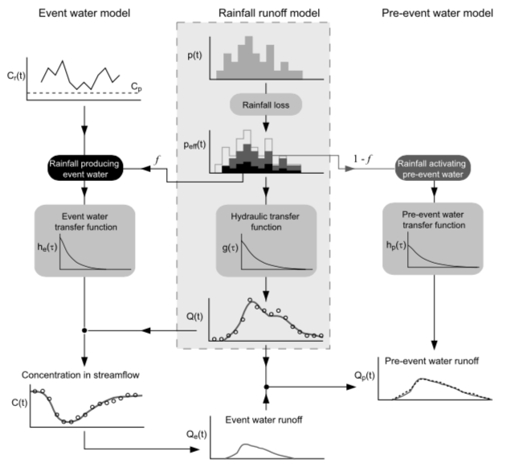

# TRANSEP
# 

The transfer function hydrograph separation (TRANSEP) package provides coupled
but constrained representations of transport and hydraulic transfer functions.
These functions can be used to simulate hydrologic response (e.g. discharge)
and tracer concentrations. The following models are available:

- Dispersion model (DM)
- Exponential piston model (EPM)
- Gamma model (GM)
- Linear reservoir model (LRM)
- Parallel linear reservoir model (PLRM)

## Full Documentation

The full documentation can be found at: https://transep.readthedocs.io

## License
This software can be distributed freely under the MIT license. Please read the LICENSE for further information.
© 2022, Robin Schwemmle (<robin.schwemmle@hydrology.uni-freiburg.de>)
